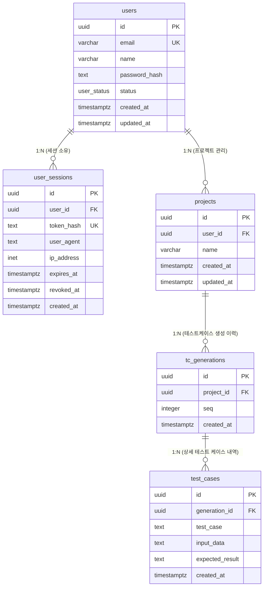

# 🗄️ TcAgent PostgreSQL 스키마 및 가상 데이터 가이드

이 문서는 제공해주신 로그인 및 프로젝트/테스트 케이스 관리 스키마 DDL을 기반으로 관계를 도해화하고, 로컬 테스트에 유용한 DML 및 조회 쿼리들을 모아둔 참조 문서입니다.

---

## 🕸️ 1. ERD (Entity-Relationship Diagram)

아래 다이어그램은 각 테이블 간의 외래 키(FK) 관계를 시각적으로 보여줍니다.



---

## 👥 2. 가상 사용자 데이터 삽입 DML

제시해주신 DDL에 맞는 가상 사용자 데이터를 생성하는 DML입니다. 로그인 승인 상태(`approved`)와 승인 대기 상태(`pending`)를 나누어 시나리오 테스트가 가능하도록 하였습니다.

```sql
-- ============================================
-- 가상 사용자 데이터 삽입 (DML)
-- ============================================
INSERT INTO users (email, name, password_hash, status)
VALUES 
    -- 1. 로그인 승인 상태의 관리자/개발자 계정
    ('admin@tcagent.com', '최고관리자', '$2b$12$SecureHashAdminPassword123...', 'approved'),
    ('chulsoo.kim@tcagent.com', '김철수 개발자', '$2b$12$SecureHashChulsooPassword123...', 'approved'),
    
    -- 2. 로그인 불가 상태(승인 대기)의 일반 계정
    ('younghee.lee@tcagent.com', '이영희 개발자', '$2b$12$SecureHashYoungheePassword123...', 'pending')
ON CONFLICT (email) DO NOTHING;

-- 삽입된 데이터 확인
SELECT * FROM users;
```

---

## 🛠️ 3. 유용한 관리 및 테스트용 SQL 템플릿

실제 개발 및 디버깅 과정에서 유용하게 쓰일 수 있는 SQL 구문 예시들입니다.

### ① 특정 사용자 로그인 세션 강제 만료 처리 (로그아웃 처리)
```sql
UPDATE user_sessions
SET revoked_at = now()
WHERE user_id = (SELECT id FROM users WHERE email = 'chulsoo.kim@tcagent.com')
  AND revoked_at IS NULL;
```

### ② 특정 사용자의 프로젝트와 최신 테스트 케이스 생성 이력 조회
```sql
SELECT 
    u.name AS user_name,
    p.name AS project_name,
    tg.seq AS generation_sequence,
    tc.test_case,
    tc.expected_result,
    tg.created_at AS generated_time
FROM users u
JOIN projects p ON u.id = p.user_id
JOIN tc_generations tg ON p.id = tg.project_id
JOIN test_cases tc ON tg.id = tc.generation_id
WHERE u.email = 'chulsoo.kim@tcagent.com'
ORDER BY tg.seq DESC, tc.created_at ASC;
```

### ③ 승인 대기 중인 사용자를 승인 상태로 변경 (어드민 승인 시나리오)
```sql
UPDATE users
SET status = 'approved', updated_at = now()
WHERE email = 'younghee.lee@tcagent.com';
```
